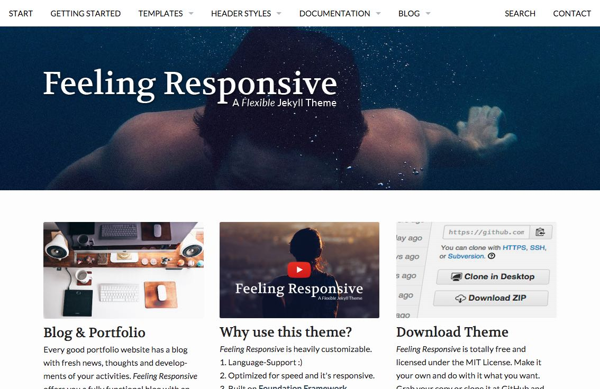

## Personal Recommendation

### I. StartBootstrap Clean Blog
Star：⭐️⭐️⭐️⭐️⭐️

Description：有题图的博客主题。布局简约，页面显示清晰，加载速度快，移动端适配友好。

此外，这也是本博客目前采用的主题，在此基础上有一些细节功能的更新。喵~

Created by [Iron Summit Media Strategies](https://github.com/IronSummitMedia), and based on [Bootstrap](http://getbootstrap.com/). 

* [Demo-Clean Blog](http://ironsummitmedia.github.io/startbootstrap-clean-blog/)
* [Fork-Startbootstrap-Clean-Blog](https://github.com/IronSummitMedia/startbootstrap-clean-blog)  Clean Blog 原版
* [Fork-Startbootstrap-Clean-Blog-Az.-Version](https://github.com/Azeril/azeril.github.io) 我的改进版，新增定制的横版大图，改进 CSS 配置及评论及目录模块。

### II. Minimal Mistakes

Star：⭐️⭐️⭐️⭐️⭐️  

Description: 有题图的博客主题。布局简约。功能模块很完善。

Created by [Michael Rose](https://github.com/mmistakes)

* [Demo-Minimal Mistakes](https://mmistakes.github.io/minimal-mistakes/)
* [Fork-Minimal-Mistakes](https://github.com/mmistakes/minimal-mistakes)

### III. Hmfaysal Omega Theme
Star：⭐️⭐️⭐️⭐️⭐️  

Description: 有动态效果的博客主题。界面优雅，页面模块多样。略微复杂，加载稍慢。

Created by [Hossain Mohd. Faysal](https://github.com/hmfaysal)

* [Demo-Hmfaysal Omega Theme](http://www.hossainmohdfaysal.com/hmfaysal-omega-theme/)
* [Fork-Hmfaysal-Omega-Theme](https://github.com/hmfaysal/hmfaysal-omega-theme)

### IV. Centrarium

Star：⭐️⭐️⭐️⭐️  

Description: 类似 Clean blog。但除了导航栏外，对于底边也布置并展示更多的博客信息。功能模块完整。

Creaded by [Ben Centra](https://github.com/bencentra)

* [Demo-Centrarium](http://bencentra.com/centrarium/)
* [Fork-Centrarium](https://github.com/bencentra/centrarium)
 
 
 
### V. StartBootstrap Business Casual

Star：⭐️⭐️⭐️⭐️  

Description: 大图作为博客整个背景的主题。有不错的图片展示框。博文输出功能可能有小状况，需自己调配后才能用。

Created by [Iron Summit Media Strategies](https://github.com/IronSummitMedia)

* [Demo-Business Casual](http://ironsummitmedia.github.io/startbootstrap-business-casual/index.html)
* [Fork-Startbootstrap-Business-Casual](https://github.com/IronSummitMedia/startbootstrap-business-casual)

### VI. Kunka

Star：⭐️⭐️⭐️⭐️  

Description: 偏小型网站、严肃风格。结构硬朗，模块充实。

Created by [掌心](https://github.com/pizn)

* [Demo-Kunka](http://pizn.github.io/kunka/)
* [Fork-Kunka](https://github.com/pizn/kunka)

### VII. Scribble

Star：⭐️⭐️⭐️  

Description: 简约风格，偏重博客标题的展示。加载速度蛮快。

Created by [muan](https://github.com/muan)

* [Demo-Scribble](http://scribble.muan.co/)
* [Fork-scribble](https://github.com/muan/scribble)

***

## Other Themes

### So Simple Theme

Star：⭐️⭐️⭐️  

Description: 与 Scribble 类似的主题。偏重主页中博客标题的展示。

Created by [Michael Rose](https://github.com/mmistakes)

* [Demo-So Simple Theme](https://mmistakes.github.io/so-simple-theme/)
* [Fork-So-Simple-Theme](https://github.com/mmistakes/so-simple-theme)

### Freshman21

Star：⭐️⭐️⭐️⭐️ 

Description: 有侧边栏的博客主题。不算特别规范的主题，但界面还算好看。

Created by * [Lijia Yu](https://github.com/yulijia)

* [Demo-Freshman21](http://yulijia.net/freshman21/)
* [Fork-Freshman21](https://github.com/yulijia/freshman21)

### Rusty Shutter

Star：⭐️⭐️⭐️⭐️ 

Description: 以图片和文章展示为核心的主题。并不算特别规范，但别具一格。

Created by [Linghua Zhang](https://github.com/waynezhang)

* [Demo-Rusty Shutter](http://lhzhang.com/)
* [Fork-Rusty Shutter](https://github.com/waynezhang/blog)

### Feeling Responsive

Star：⭐️⭐️⭐️⭐️  

Description: 混合型博客，架构偏小型网站。文章、视频都作为展示的内容并存。模块丰富，但结构略复杂。

Created by [Moritz »mo.« Sauer](https://github.com/Phlow)

* [Demo-Feeling Responsive](http://phlow.github.io/feeling-responsive/)
* [Fork-Feeling-Responsive](https://github.com/Phlow/feeling-responsive)

### Twister Jekyll Theme

Star：⭐️⭐️⭐️  

Description: 融合文章与视频展示的主题。结构中规中矩。加载速度上会慢一些。

Created by [DigitalMind](https://github.com/DigitalMindCH)

* [Demo-Twister Jekyll Theme](http://digitalmind.ch/themes/twister-jekyll-theme/demo/)
* [Fork-Twister-Jekyll-Theme](https://github.com/DigitalMindCH/twister-jekyll-theme)

### Slim Pickins Jekyll Theme

Star：⭐️⭐️⭐️  

Description: 具有横版大图特性的主题。导航栏在大图下，还算清爽。

Created by [C Tarwater)](https://github.com/chrisanthropic)

* [Demo-Slim Pickins Jekyll Theme](http://chrisanthropic.github.io/slim-pickins-jekyll-theme/)
* [Fork-Slim-Pickins-Jekyll-Theme](https://github.com/chrisanthropic/slim-pickins-jekyll-theme)

  
### Lanyon

Star：⭐️⭐️⭐️  

Description: 异常简约的一个主题，白底黑字。优势是加载速度很快。在此主题基础上也衍生出不少新主题，界面变化不大，但有增加如导航栏一类的东西。

Created by [Poole](https://github.com/poole)

* [Demo-Lanyon · A Jekyll theme](http://lanyon.getpoole.com/)
* [Fork-Lanyon](https://github.com/poole/lanyon)

### Balzac-for-Jekyll

Star：⭐️⭐️⭐️  

Description: 简约，也可以启用大图视窗作为博客主界面。

Created by [Cole Townsend](https://github.com/ColeTownsend)

* [Demo-Balzac for Jekyll](http://tuxador.github.io/)
* [Fork-Balzac-for-Jekyll](https://github.com/ColeTownsend/Balzac-for-Jekyll)

  
### Shiori

Star：⭐️⭐️⭐️  

Description: 最大特点是 卡哇伊...

Created by [Elle Kasai](https://github.com/ellekasai)

* [Demo-Shiori](http://ellekasai.github.io/shiori/)
* [Fork-Shiori](https://github.com/ellekasai/shiori)

## More Jekyll Themes To Explore

1. [Jekyll Themes](http://jekyllthemes.org/) Jekyll Blog Themes 精选。主题众多，得益于使用 GitHub Pages 博客服务的网友的众人推荐之力，被挖掘出来并展列其中的精良主题不在少数。
2. [All Free Bootstrap Themes & Templates - Start Bootstrap](http://startbootstrap.com/template-categories/all/) Start Bootstrap 主题博客的主站。制作精良的 Jekyll 主题。优质主题已在前述清单里推荐，分别为 Clean Blog 及 Business Casual。另外有不少很棒的偏展示为主的博客主题，没放进来，但如果需要做小型网站，也算不可错过。此外，也有不少只有框架的半成品。
3. [Jekyll Blogs Sites - Jekyll Wiki](https://github.com/jekyll/jekyll/wiki/Sites) Jekyll 官方 Wiki 索引的博客列表。海量，不过好看的不多，大多数是残次品...找合意的估计是得大海捞针一般。